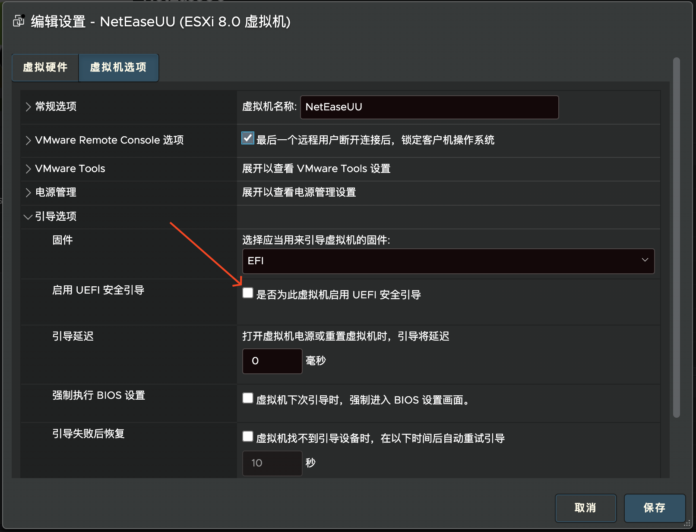
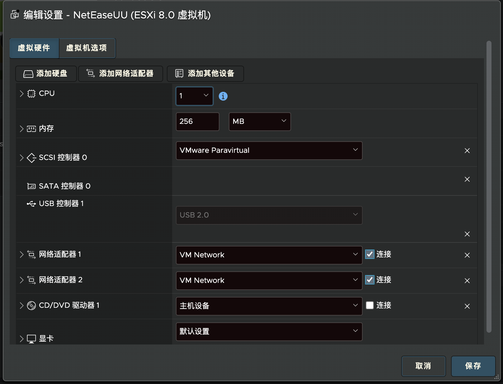
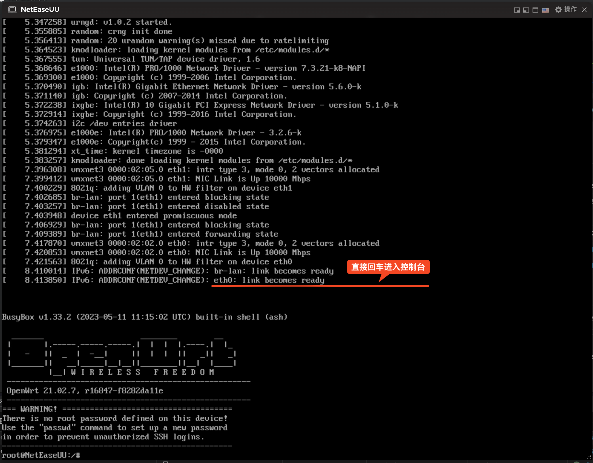
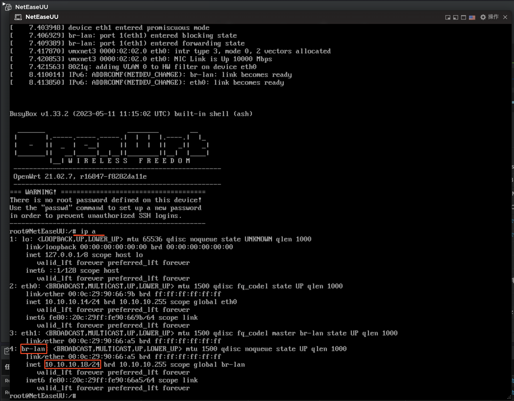

# NetEaseUU

> 这是一个专为网易 UU 加速器构建的 OpenWrt 版本, 该系统最终作为单臂路由运行在虚拟机内并为内网设备提供游戏加速.
>
> 本仓库 Fork 自 [Revincx/MyWrtBuilder](https://github.com/Revincx/MyWrtBuilder) 感谢原作者付出🙏, 为关闭 PR 提示移除了 Github Fork, 特在此说明.

## 虚拟机配置

请提前创建好 VM 虚拟机, 虚拟机要求如下:

- 1、虚拟机需要分配两个网卡
- 2、当使用 EFI 引导时需要关闭 UEFI 安全引导
- 3、内存大小最好大于等于 256MB
- 4、虚拟机不需要额外硬盘, 只保持编译好的 OpenWrt 硬盘即可

## 插件配置

该系统默认**无 ROOT 密码、无 LUCI 界面**, 系统启动后等待日志不再滚动, 直接回车即可进入终端.

在终端中输入 `ip a` 命令可查看网卡 IP, **手机添加路由器时, 将网关设置为 `br-lan` 的 IP, 然后返回 APP 继续添加即可.**

## 其他说明

- 1、系统启动后默认会联网安装 UU 插件(见 [files/etc/init.d/uu](files/etc/init.d/uu) 脚本)
- 2、系统默认将第一个网卡(eth0) 设置为 WAN 出口, 另一个网卡为 LAN
- 3、手机 APP 添加路由时必须将网关设置为 `br-lan` 的 IP, 否则会提示不支持
- 4、PVE 用户可能需要执行 `opkg install qemu-ga` 包来实现优雅关机
- 5、默认 ROOT 密码为空, 所以可以通过两个网卡的任意 IP 进行 SSH 连接
- 6、如果期望查看 SN 信息, 可执行 `logread` 命令查看日志
